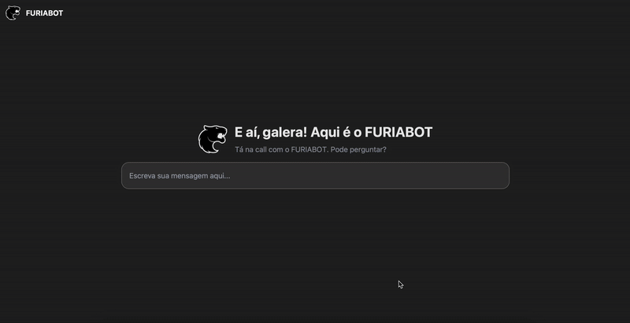

# 🤖💻  Chatbot-FURIA

Um chatbot esportivo focado em eSports que fornece informações detalhadas sobre a equipe FURIA de CS:GO. Ele utiliza a PandaScore API para coletar dados em tempo real, que são armazenados no Firebase para consulta e histórico. A inteligência das respostas é gerada por um modelo LLaMA3 via Groq API. O backend é construído com Flask e a interface é desenvolvida com Tailwind CSS e JavaScript.

## 📦 Tecnologias Utilizadas

- **Python + Flask** – Backend leve e eficiente.
- **Groq API (LLaMA3)** – Respostas geradas por modelo de linguagem de última geração.
- **PandaScore API** – Fonte de dados de eSports, especialmente para estatísticas da FURIA.
- **Firebase** – Armazenamento de histórico e persistência de dados.
- **Tailwind CSS** – Estilização rápida e responsiva da interface.
- **JavaScript** – Lógica e interatividade do frontend.

## 🚀 Como Rodar Localmente

### 1 - **Clone o repositório:**

```bash
git clone https://github.com/CarolShingai/Chatbot-Furia.git
cd Chatbot-Furia
```

### 2 - Crie um ambiente virtual e ative:
```bash
python -m venv venv
source venv/bin/activate  # Linux/Mac
venv\Scripts\activate
```

### 3 - Instale as dependências:
```bash
pip install -r requirements.txt
```

### 4 - Configure suas variáveis de ambiente:
```bash
**GROP_KEY**=your_groq_key
**PANDASCORE_KEY**=your_pandascore_key 
```
## 🔐 Como obter as chaves de API
Para que o chatbot funcione corretamente, você precisa obter e configurar três chaves:
#### 🧠 Groq API (LLaMA3)
1. Acesse: https://console.groq.com/
2. Crie uma conta (se necessário).
3. Crie um novo projeto e copie sua API Key.
4. Adicione ao .env
```bash
**GROQ_KEY**=your_groq_api_key
```
#### 🎮 PandaScore API
1. Acesse: https://www.pandascore.co/
2. Crie uma conta gratuita.
3. Vá em "My API Keys" no painel e gere uma nova.
4. Adicione ao .env
```bash
**PANDASCORE_KEY**=your_pandascore_key 
```

#### ☁️ Firebase
1. Acesse: https://console.firebase.google.com/
2. Crie uma conta (se necessário).
3. Crie um projeto novo.
4. Vá em "Configurações do Projeto" > "Contas de Serviço".
5. Gere uma nova chave privada JSON.
6. Na raiz do projeto crie a pasta **"credentials"**
7. Salve o arquivo e adicione na pasta **"credentials"**

### 5 - Inicie o servidor Flask:
```bash
flask run 
```

### 6 - Acesse o app:
Abra o navegador e vá para `http://127.0.0.1:5000`

## 💡 Funcionalidades:
- 🧠 Chatbot inteligente com modelo LLaMA3 (via Groq API) que entende contexto e gera respostas naturais.   
- 🎯 Informações em tempo real sobre a FURIA, incluindo:
👨‍👩‍👧 Time principal e time feminino
- 🧍‍♂️ Perfil de jogadores (nome, função, time atual, etc.)
- 🕒 Próximas partidas com data e horário
- 🕹️ Histórico de partidas passadas com resultados
- 🖥️ Interface responsiva feita com Tailwind CSS
- 🛒 Link para a loja oficial da FURIA.

## Sobre a Autora
Esse projeto foi desenvolvido por [Carol Shingai](https://github.com/CarolShingai),  entusiasta de games, tecnologia e inteligência artificial. Criar este chatbot foi uma jornada desafiadora e extremamente enriquecedora. Ao longo do processo, me aventurei com tecnologias que nunca havia utilizado antes — enfrentando erros, aprendendo na prática e evoluindo a cada etapa. Mais do que um exercício técnico, foi uma experiência real de aprendizado, na qual pude aplicar conceitos importante e,  ao final, obter um resultado com o qual fiquei verdadeiramente satisfeita.

## Resultado:
<p align="center">
<br>
</p>

